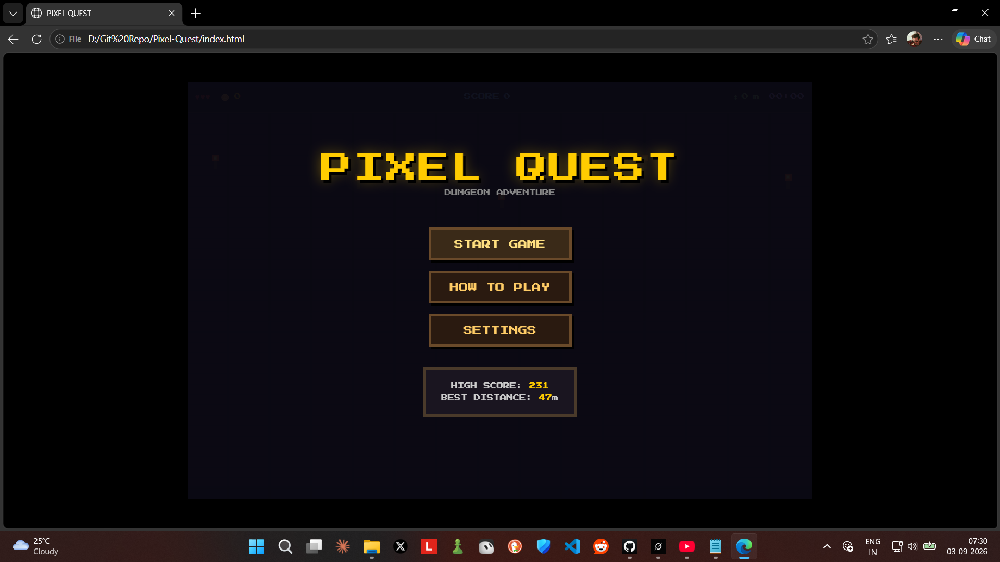
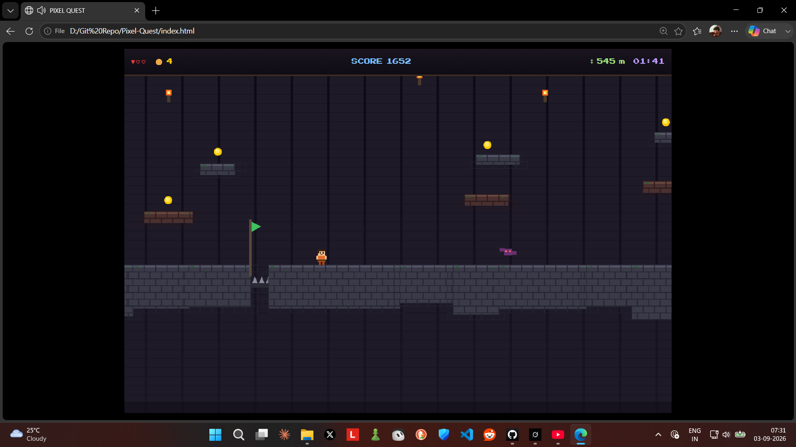

# PIXEL QUEST

**A classic 2D pixel-art platformer dungeon adventure** built entirely with HTML5 Canvas and vanilla JavaScript.

Explore an endless procedurally generated dungeon, collect coins, stomp enemies, grab power-ups, and push for the highest distance and score!





---

## Features

- Endless procedural dungeon generation
- Smooth pixel-perfect movement & camera
- Collectible coins and power-ups (hearts + speed boost)
- Enemies: Slimes and flying Bats (stomp to defeat)
- Spikes, checkpoints, and increasing difficulty
- Particle effects, screen shake, and retro sound effects
- Background music (toggleable)
- High score & best distance saved in localStorage
- Full touch controls for mobile
- Pause menu, Game Over, and New Record screens
- Responsive design (desktop + mobile)

---

## Controls

| Action       | Keyboard              | Touch / Mobile     |
|--------------|-----------------------|--------------------|
| Move Left    | ← or A                | ◀ button           |
| Move Right   | → or D                | ▶ button           |
| Jump         | Space / ↑ / W         | A button           |
| Pause        | P                     | ❚❚ button          |

---

## How to Run

### Option 1 – Just open it
1. Download or clone this repository
2. Open `index.html` in any modern browser (Chrome, Firefox, Edge, Safari)

### Option 2 – Local server (recommended)
```bash
# Using Python
python -m http.server 8000

# Using Node.js (if you have npx)
npx serve .
```
Then open `http://localhost:8000`

---

## Project Structure

```
.
├── index.html          # Complete game (HTML + CSS + JS)
├── README.md
└── screenshots/        # Place your screenshots here
    ├── menu.png
    └── gameplay.png
```

---

## Technologies

- Pure **HTML5 Canvas**
- Vanilla **JavaScript** (no frameworks)
- **Web Audio API** for sound & music
- **localStorage** for high scores & settings
- Pixel-art style using the classic Press Start 2P font

---

## License

This project is open source and free to use / modify.

---

Made with ♥ for the love of classic platformers.
